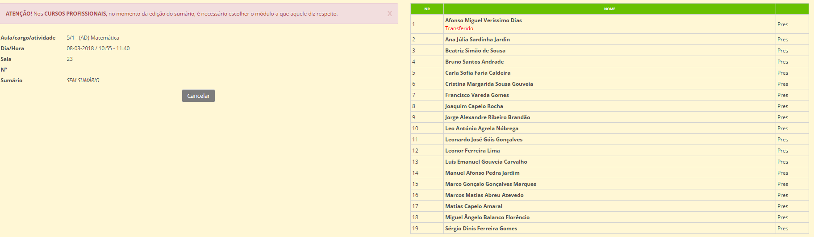
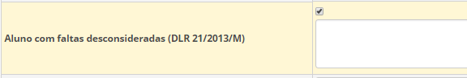


# Faltas

*"A falta é a ausência  do aluno a uma aula ou outra atividade de fequência obrigatória ou facultativa caso tenha havido lugar a inscrição, a falta de pontualidade ou a comparência sem o material didático ou equipamento necessários..."*

[Estatudo do Aluno](http://joram.madeira.gov.pt/joram/1serie/Ano%20de%202013/ISerie-082-2013-06-25.pdf
) 

_____

O controlo da assiduidade dos alunos **é obrigatório** por parte de todas as escolas da RAM. 

Sempre que um aluno estiver ausente de uma aula ou atividade obrigatória deve ser registada falta por parte do parte do professor responsável pela disciplina. 

As faltas são marcadas **pelo docente** no momento que faz o sumário. O docente clica no separador **Sumários**, escolhe o **Cargo/atividade/aula** (ex: Matemática), seleciona o mês e clica em **editar** para abrir o Sumário. Escreve o Sumário da respetiva disciplina e no lado direito aparece o nome de todos os alunos que integram essa turma/disciplina. O professor marca **falta injustificada** aos alunos ausentes.

|Responsáveis     | Marcação de faltas           | Observações  |
| :---------------: |:----------------:| :-----:|
| **Professor da Disciplina**    | da disciplina| Professor marca *Falta Injustificada* na ausência do aluno |
| **Diretor de turma**  | Pode: Marcar falta, Justificar e/ou Remover      |   Só o diretor de turma pode modificar as faltas. Ex: falta Injustificado, o D.T. pode justificar mediante a justificação. |
| **Direção Executiva ou Serviços Administrativos**   | Pode abrir durante 15 a alteração de faltas noutro período.      |    Depois de abrir, pode fechar,mas caso não feche, a aplicação fecha automaticamente após 15 dias. |

>[!WARNING]  
> As faltas dos alunos são geridas e trancadas em cada período.

## Desconsiderar Faltas

*"Sempre que cesse o incumprimento do dever de assiduidade poderão sr desconsideradas as faltas em excesso por proposta do diretor de turma apresentada ao orgão de gestão, que decidirá em funçao da análise do comportamento edo grau de empenho revelados pelo aluno em causa"*

                                                                     
                                                                     Estatudo do Aluno 

No final do ano letivo, o diretor de turma pode propôr à direção para desconsiderar as faltas do aluno. Após análise do mesmo e caso seja aceite, a **Direção** pode autorizar a desconsideração  das faltas do aluno:

- O DT entra na matrícula do aluno, clica em editar
- Depois clica onde diz ***Aluno com faltas desconsideradas (DLR 21/2013/M)***

Depois deste processo, o DT vai ao aluno e desconsidera as faltas que pretende. 

### Apoios

Nas aulas dadas como **apoios** não há marcação de faltas, mas sim **presenças** aos alunos prensentes. 

