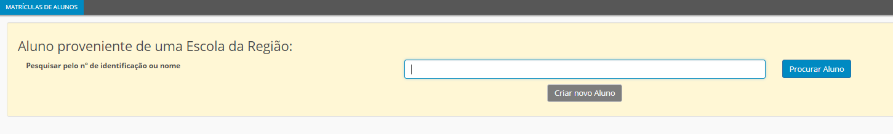

# Matrícula

A matrícula é obrigatória e confere o estatudo do aluno, o qual, para além dos direitos e deveres previstos na lei, designadamente no estatuto do aluno, integra os que estão contemplados no regulamento interno da escola. 

Todos os aluno devem ser matrículados corretamente, preenchendo os dados no separador alunos, clicando na etiqueta novo aluno. Deve preencher todos os dados, dando especial atenção a data de início de frequência do aluno na escola. 

A matrícula corresponde à 1ª vez que o aluno inscreve-se numa escola. 

> [!NOTE]  
> Na matrícula dos alunos, as escolas devem ter especial atenção aos alunos imigrantes: Quando estes alunos são matrículados, devem fazê-lo corretamente: se o aluno tiver **Portugues Língua Não Materna (PLNM)** devem ser **matriculados em PLNM e NÃO em Português**, mesmo que não tenham uma turma só com PLNM.

