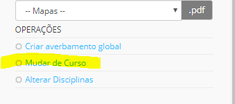
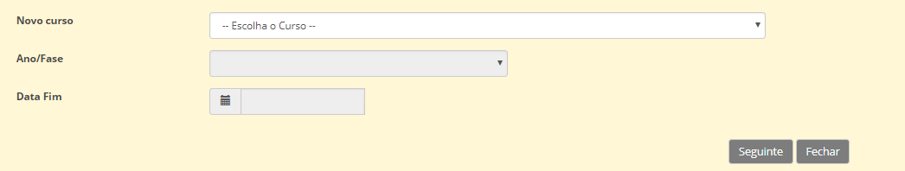

# Mudança de Curso

Após a matrícula dos alunos, no início do ano ou mesmo no decorrer do mesmo, se o aluno mostrar interesse em mudar de curso é possível. 

Para tal, a escola deve seguir os seguintes passos: 

- Ir ao **aluno**
- Entrar na **matrícula** do mesmo
- no lado clicar em **mudar de curso**

Deve preencher os dados solicitados e gravar.

> [!WARNING]  
> Na mudança de Curso é muito importante colocarmos a data correta da mudança, ou seja, a data de início de frequência. 

