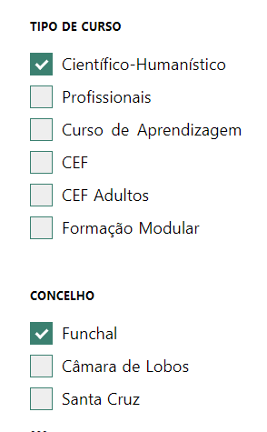
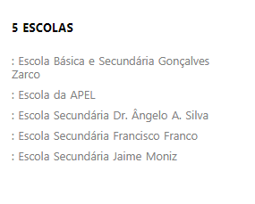
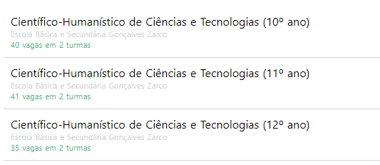
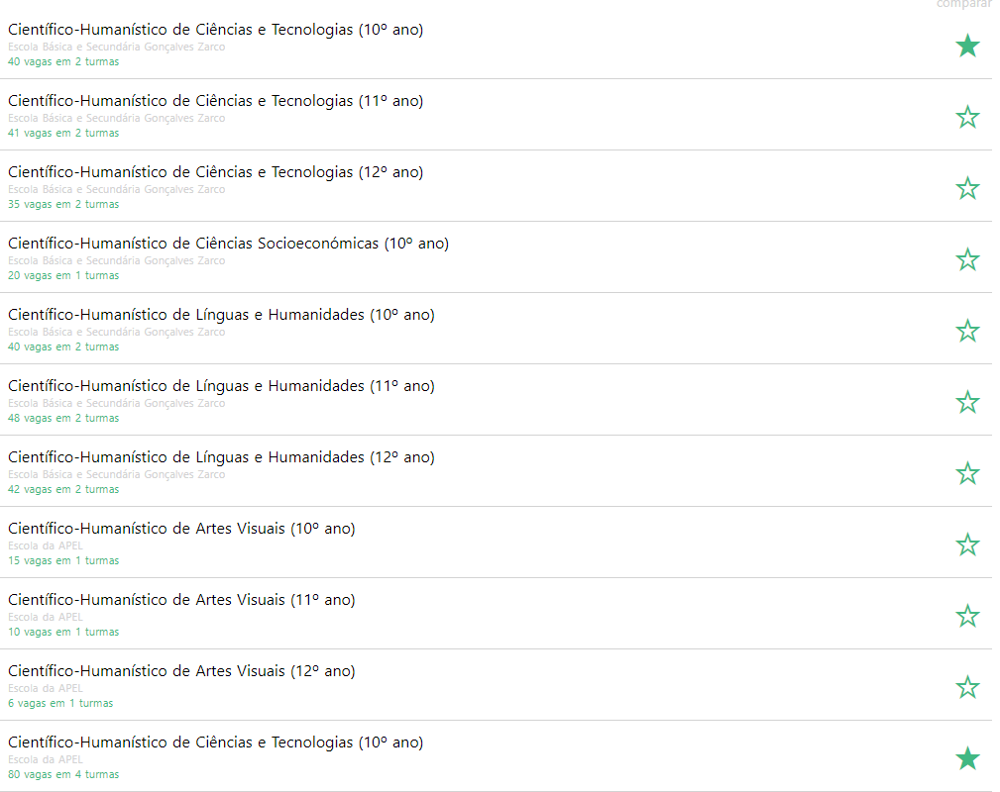
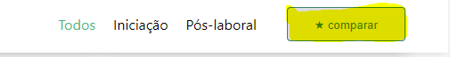
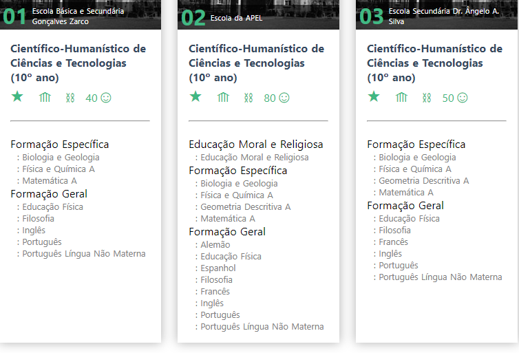
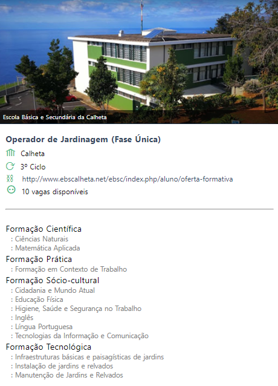

# Oferta Formativa

Para o ano 2018/2019, à semelhança dos anos anteriores, a plataforma Place disponibiliza um site referente à Oferta educativa e formativa, onde os Encarregados de educação e/ou os alunos interessados poderão consultar e analisar as escolas, os cursos, as disciplinas, podendo comparar e escolher os cursos que mais se adequam ao seu perfil. 

Poderá consultar a oferta formativa apresentada no link a baixo:

   [Oferta Formativa 2018](http://place.madeira.gov.pt/ofertaformativa/)

> [!NOTE]  
> Este site apenas funciona como consulta da oferta formativa, não como pré-matrículas ou como matrículas das escolas selecionadas. 

A página apresentada está dividida por tipos de curso, concelhos e por ciclos (2º, 3º ciclo e secundário) 

A título de exemplo, se selecionar Cursos Científico-Humanístico no concelho do Funchal:

No lado direito do ecrã, aparece todas as escolas que oferecem o tipo de curso que selecionou: 

Paralelamente apresentamos o ano em que o curso é lecionado, o número de vagas e o número de turmas existente. 

Este leque de informações permite analisar e escolher ao pormenor o percurso que pretende seguir, de modo a ir ao encontro dos interesses pessoais e profissionais de cada aluno.

Pode igualmente escolher um curso (Ex: Ciências e tecnologias) em diferentes escolas, clicando na estrelinha que aparece a frente dos cursos (A estrela fica preenchida ao ser selecionada).

Depois de selecionar o curso e as escolas que demonstra interesse, clique no botão **Comparar**

Ao comparar, apresentamos as disciplinas dadas nos mesmos cursos em diferentes escolas. Isto permite escolher o curso, tendo em conta as disciplinas que vão lecionar dentro de cada componente.  

 Nesta mesma página, caso esteja interessado em algum curso ou escola, clica nos itens assinados para visitar diretamente a página oficial da Escola e obter mais informações 

 

>[!NOTE]  
> Se apenas interessa-lhe um curso numa determinada escola, clica em cima do respetivo curso para podê-lo analisar. 

Poderá partilhar o curso que interessar via Facebook, se assim o desejar.

