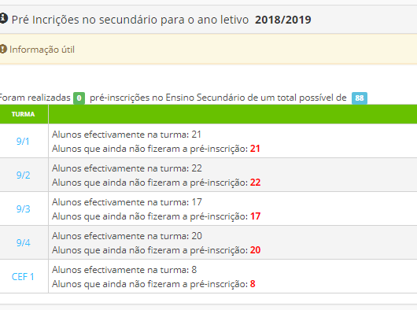
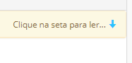
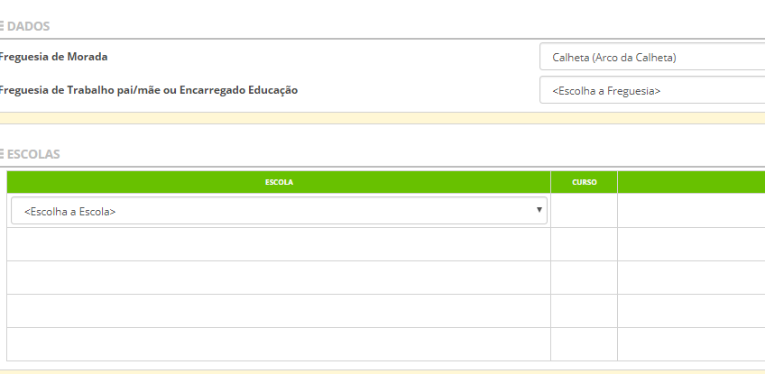

# Pré - Inscrições (9º Ano de Escolaridade)

Para o ano Letivo 2018/2019 já estão abertas as pré-inscrições para os alunos que estejam a frequentar o 9º ano de escolaridade, incluindo CEF´s, independentemente do seu sucesso escolar no respetivo ano.

Todas as escolas da Região, terão ao seu dispor o número de turmas a frequentar o 9º ano e aos respetivos alunos.

> [!NOTE]  
> Deve baixar e ver a informação disponível que aparece nesse ecrã de forma respeitar todos os procedimentos necessários.

Cada diretor de turma (DT) deverá preencher a pré-inscrição da sua turma, juntamente com os alunos.

Cada aluno deve preencher os seguintes dados:

- Freguesia da morada

- Freguesia do trabalho do encarregado de educação

- As escolas que gostava de frequentar no 10º ano por ordem de interesse

Caso tenha algum irmão já a frequentar essa escola (a que pretende ir) deve mencionar isso no campo indicado.

Esta Pré - Inscrição tem como objetivo permitir e estabelecer uma perceção das preferências dos alunos para o ensino secundário e procurar, dentro dos limites, dar resposta de forma a equilibrar a procura e a oferta no ensino na região.

 

