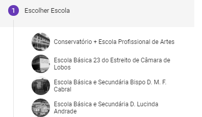
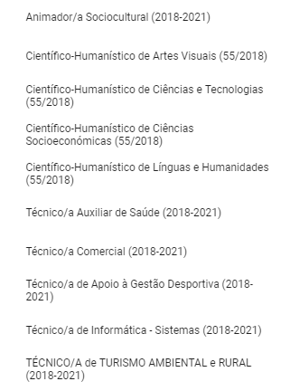
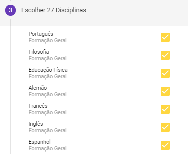
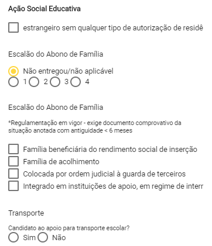

# Pré-Matrículas Online 10º ano

Para o ano letivo 2018/2019 iremos disponibilizar novas aplicações para as pré-matrículas online para os alunos que **vão ingressar nas escolas secundárias** públicas e privadas da RAM. Estas aplicações vistam a facilitar o processo de gestão escolar e melhorar o processo, diminuindo o congestionamento e tempo de espera dos alunos no ato de matrícula. 

Todos os alunos que transitam para o secundário e vão matricular-se numa escola diferente da que frequentaram no 9º ano (ou equivalente), podem realizar uma pré-matrícula utilizando o token (código de 12 carateres) disponibilizado no fundo do **registo biográfico** individual. Este token deve ser **utilizado exclusivamente pelo aluno** para aceder à aplicação Place Aluno.

A aplicação web está disponível através de [matrículas online](https://place.madeira.gov.pt/placealuno) e na aplicação android na PlayStore , pesquisando por “Place Aluno”. 

Para poder realizar a pré- matrícula deverá seguir os seguintes passos: 

## Criar Conta nas aplicações

**Registo no PLACE Aluno**:

**1º passo:** Aceder à aplicação ou no Android Pesquisar na PlayStore por ‘PLACE Aluno’.

**2º passo**: Criar conta

Na primeira vez que aceder terá de criar uma conta que permanecerá durante os próximos anos em que frequentar escolas da RAM. Para tal, escolha a opção ‘Criar conta’ no fundo da página.

**3º passo** – Validar token

Deve inserir o token disponível no seu registo biográfico no local apropriado

**4º passo**: – Dados da conta

Se o token foi validado com sucesso, o seu nome aparece pré-preenchido. Deve inserir o nome de utilizador que pretende, o seu email e a palavra-chave de acesso.

**5º passo** – Submeter

Se a *conta for criada com sucesso*, será visível no ecrã o botão do PLACE Aluno a verde, pelo que deverá carregar no botão ‘Continuar’.

> [!IMPORTANT]  
> Depois da criação da conta, acederá automaticamente à aplicação PLACE Aluno. Futuramente, para aceder, deverá introduzir o nome de utilizador ou email preenchidos na criação de conta, junto da palavra-chave que digitou.

### Pré-Matrícula 

Depois de criar conta com sucesso, tem todas as condições para realizar a pré-matrícula com sucesso. 

Para poder realizar a Pré-Matrícula deverá preencher os seguintes campos: 

- Escolher a **Escola**

- Confirmar os **dados pessoais** do aluno 

- Preencher os dados do **encarregado de educação**

- Selecionar o **Curso**

- Selecionar as **disciplinas**

- Atribuir o **ASE** e Transporte (Caso necessite)

- **Concluir** o processo de Pré-Matrícula

> [!IMPORTANT]  
> Depois de conluir o processo da Pré-Matrícula, deve descarregar e impirmir o **comprovativo**. Depois de impresso, o **encarregado de educação deve assinar** o documento. Posteriormente, o aluno deve levar o comprovativo assinado para a escola no dia das matrículas (dia marcado pela Escola responsável) 

