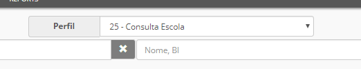
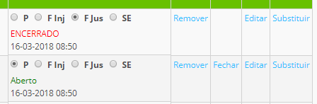

# Faltas

O controlo da assiduidade dos professores é possível para as escolas que assim o desejarem.

Sempre que um professor estiver ausente de uma aula deve ser registada falta por parte da Direção Executiva ou por outro utilizador responsável pelo mesmo. Este último, deve usar o perfil **Consulta Escola** 

Deve procuar por datas, ou seja, pelo dia que pretende e aparece todos os docentes que lecionam nesse dia. Para os docentes ausentes, apenas marca **Falta injustificada**

Só a direção pode justificar a falta, mediante a justificação do docente.

> [!WARNING]  
> Existe uma falta designada como **Serviço Externo** (SE) que deve ser marcada quando o professor está a trabalhar fora da escola e não comparece a uma determinada aula ou atividade obrigatória. Aplica-se por exemplo: **Desporto Escolar ou Visitas de Estudo**.

> [!NOTE]  
> As escolas com cursos financiados, as faltas dos docentes têm outro valor. Há somatório de horas dadas, horas por lecionar e um confronto com as horas totais previstas no início do curso.

