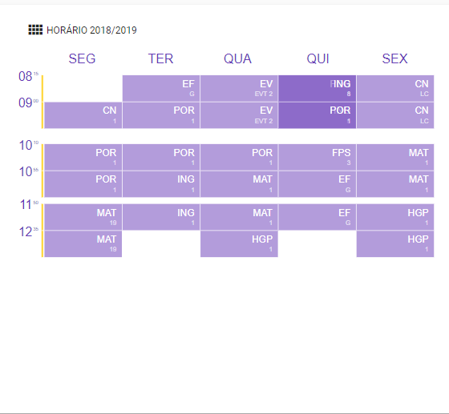
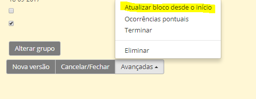

# Horários

A componente letiva semanal dos professores organiza-se em blocos.

Estes blocos destinam-se ao trabalho dos docentes com os alunos nas áreas curriculares disciplinares e não disciplinares, às aulas de apoio educativo, bem como as horas a distribuir aos professores para o desempenho dos cargos de articulação curricular e de direcção de turma.

Todos os docentes devem ter o seu horário criado na plataforma place e possuí-lo em formato papel.

De forma a fazer os horários, os serviços administrativos ou a equipa de horários devem fazê-lo no nome do professor no separador horários e editar.

- Preenche os dados solicitados corretamente
- Guardar
- Atualizar ocorrências
- Avançadas  --->  Atualizar bloco desde o início
- Guardar

> [!NOTE]  
> Dar especial atenção da data de início das aulas ou atividades preenchidas nos horários.

