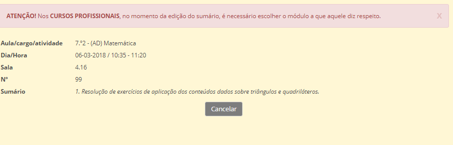

# Sumários

É importância que todas as aulas lecionadas tenham registo do sumário. O sumário é gerado no prórpio dia e ao ser preenchido marca presença automática ao professor.  

Relembramos que os sumários devem ser preenchidos pelo docente responsável da disciplina ou módulo, na plataforma place, dentro do prazo estabelecido pela **Escola**.

Caso o prazo não seja respeitado, o sumário é fechado e só a direção da escola, após pedido do docente responsável, podera abri-lo novamente.

Preenche o sumário, escolhendo a disciplina, horário e turma. Na mesma página fará a marcação de presenças dos alunos.

No caso de substituições, o sumário é feito pelo docente que deu a aula, mas o professor que faltou consegue visualizar o respetivo sumário. 

> [!WARNING]  
> Recomendamos que todos os docentes guardem os PDF dos seus súmários mensalmente.