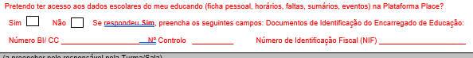
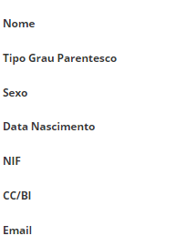
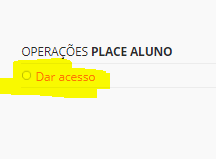
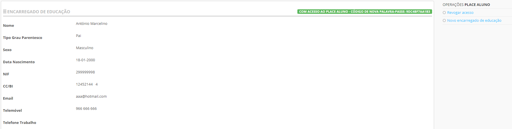
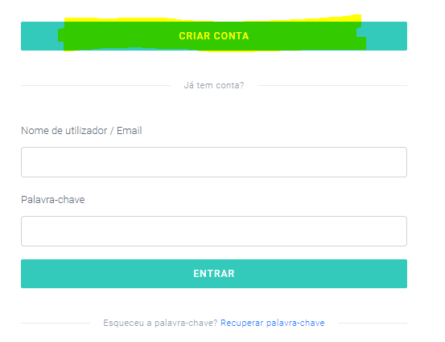
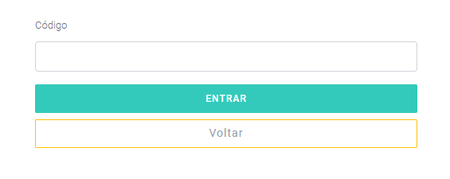
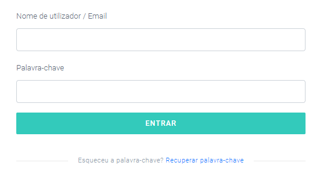
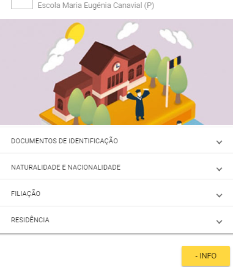
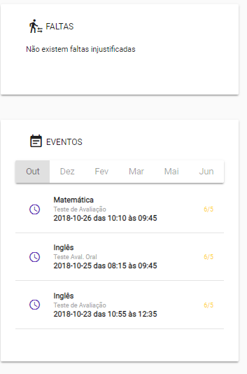

# Acesso ao Place

Para as renovações 2018/2019, estamos a solicitar através do boletim de renovação, a todos encarregados de educação que estejam interessados em ter acesso a Plataforma Place, que assinalem o seu interesse e registe os dados necessários para permitir o seu acesso. 

Neste acesso, terão a possibilidade de consultar os dados escolares dos seus educandos, nomeadamente:

- Ficha pessoal

- Horários 

- Faltas 

- Eventos

- E outras situações que demonstrem ser igualmente importantes.

> [!WARNING]  
> Este acesso deverá sempre salvaguardar e proteger os dados de todos os alunos. Cada encarregado de educação deve salvaguardar os dados dos seus educandos. 

# Place Aluno

Para o ano letivo 2018/2019, a Plataforma Place disponibilizou aplicações para que o **encarregado de educação**  tenha acesso às informações educativas dos seus educandos.

Para que o acesso seja feito corretamente, **as escolas devem de validar o encarregado de educação**.

1. Ir ao **aluno**
2. Separador **encarregado de educação** 
3. Preencher os dados obrigatórios do encarregado de educação:

 

4. Dar acesso 

Ao clicar neste item, **vai gerar um código** de acesso, o qual deve fornecer a cada encarregado de educação que solicite. 

> [!IMPORTANT]  
> Em caso de esquecimento da palavra-passe, pode clicar em **nova palavra-passe**. No caso de haver mudança do encarregado de educação, a escola deve clicar em **revogar acesso** ao anterior encarregado de educação. A qualquer momento, caso seja necessário e devidamente justificado, pode criar um **novo encarregado de educação**. 

> [!NOTE]  
> Os encarregados de educação devem pedir o acesso nos serviços administrativs da escola e atualizar os dados do encarregado de educação nas diferentes escolas onde tenham filhos a frequentar (caso tenham mais que um filho). 

Quando o encarregado de educação tiver em sua posse o código de acesso deve aceder:  

[versão web](https://place.madeira.gov.pt/placealuno) ou através de aplicações móveis para [Android](http://bit.ly/PlaceAlunoDroid) e [iOS](http://bit.ly/PlaceAlunoiOS), ou pesquisando pelo nome da aplicação na Play Store e App Store, respetivamente.

Caso seja o primeiro acesso deve:

**1º passo**: Criar conta

**2º passo** – Validar código

Deve inserir o código disponibilizado pela escola.

**3º passo**: – Definir nome do **utilizador e palavra-passe**

Neste campo, é importante escolher o **utilizador e palavra-passe** e que tenha a consciência que serão sempre necessários quando quiser aceder a aplicação. 

Após a criação da conta (apenas uma vez) deve entrar utilizando o utilizador e palavra-passe definidas para entrar na aplicação. 

Quando entra na aplicação consegue visualizar:

- Os educandos e as escolas onde estão matriculados. 

- Se clicar num aluno irá aparecer: 

1. **Ficha pessoal do aluno**

2. **O Horário**

3. **Eventos** importantes do aluno

a) Faltas e testes marcados

 

> [!CAUTION]  
> Há apenas um encarregado de educação! Este deve, sempre, garantir a segurança e proteção dos dados pessoas da criança/aluno. Deve manter o acesso às aplicações do Place em segurança.  

