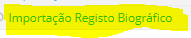
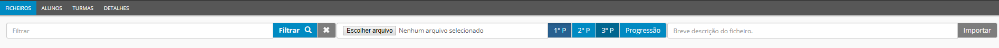

# Importação de dados

Este separador serve para as escolas importarem os dados da escola para a plataforma place, para que esses fiquem registados no registo biográfico dos alunos, dos horários e de outras informações úteis à gestao escolar. 

Há exceções à regra: Escolas que têm a sua gestão particular de notas e têm que as importar para o place em cada período letivo, Clicando em:

- Escolhe o ficheiro que pretende importar, seleciona o período em questão e faz uma breve descriçao e importa para a plataforma place.

