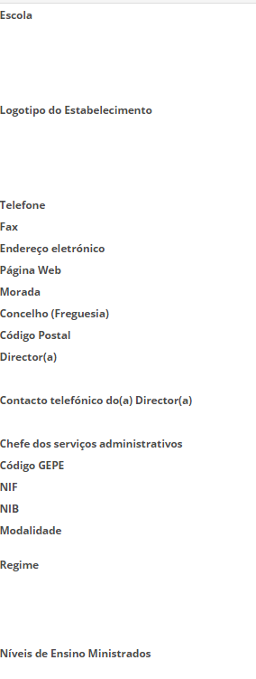

# Recursos da Escola

Na página principal da escola, no lado direito tem um botão menu.

Ao clicar neste funcionalidade, aparece várias funcionalidades relacionadas com a escola, nomeadamente: 

- Dados da Escola
- Recusos Humanos
- Recursos Materiais
- Hardware
- Quadros interativos
- Cartões eletrónicos. 

Todos estes itens devem ser preenchidos e sempre que possível, atualizados.

Dando especial atenção aos **dados da escola**, este separador deve conter informações sempre atualizados.

 

> [!WARNING]  
> Sempre que houver alteração do contato, email, Diretor ou de chefe dos serviços administrativos deve editar este separador e guardar os novos dados. 