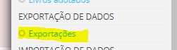
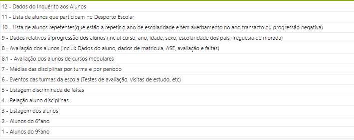
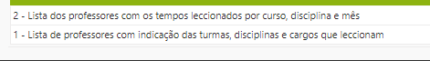

# Exportação de dados

Na página principal do place, no canto superior direito ao clicar no menu encontrará o separador **Exportações**

Neste, poderá exportar dados sobre:

- Alunos
- Professores
- ENEB/ENES/PAEB

Relativamente ao **Alunos** poderá ter ao seu dispor uma panópola de informaçoes nomeadamente: 

No que diz respeito aos **professores** poderá ter ao dispor dois tipos de listas:

No que concerne ENEB/ENES/PAEB poderá explorar as seguintes funcionalidades:

É importante referir que o ficheiro **PAEB** refere-se ao 5º e 8º ano, o ficheiro **ENEB** destina-se aos alunos do 9º ano e o ficheiro **ENES** é direcionado para os alunos do secundário. 