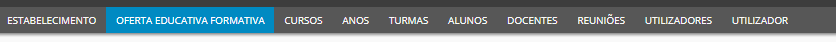
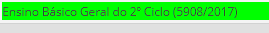
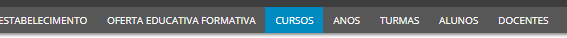
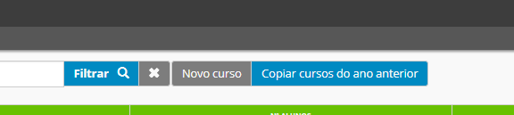
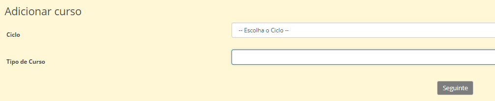
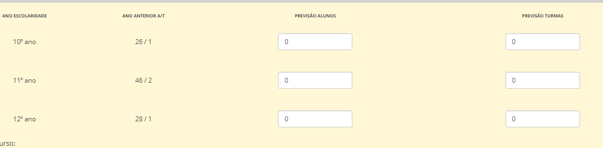

# Oferta Formativa

A plataforma Place disponibiliza, todos os anos letivos, um separador designado **Oferta Educativa Formativa**, o qual visa estimar e apresentar os tipos de cursos que as escolas pretedem oferecer, os ciclos que pretende exercer, o número estimado de alunos matrículados e o número de turmas que pretende ter em cada tipo de curso. 

Para o ano letivo 2018/2019, a inserção da oferta formativa e educativa de cada escola deverá decorrer entre **14 e 18 de Maio** de 2018 respeitosamente.  

Cada escola deve introduzir os cursos (novos e os de continuidade), previamente *autorizados pela DRE*. A introdução de cursos não validados pela DRE é da **exclusiva responsabilidade da escola**.

> [!WARNING]  
> Na criação da Oferta Formtiva, as escolas devem ter especial aos **novos cursos** de início de ciclo, nomeadamente: 5º, 7º e 10º ano de escolaridade. Devem criar novos crusos com o diploma em vigor (como podemos exemplificar no caso do 5º ano com o diploma 5908/2017)

> [!NOTE]  
> As escolas que já tenham iniciado os novos cursos em 2017/2018 devem dar continuidade para o 6 ano de escolaridade. No caso das escolas que só farão para ano letivo 2018/2019 devem criar os novos cursos somente para o 5º, 7º e 10º ano. 

Os Cursos copiados devem ser editados:

- Remover as disciplinas que não vão lecionar 
- Acrescentar as disciplinas que vão ministrar 
- Designar a componente, nome e ano 

## Cursos 

Para que as escolas possam preencher a oferta formativa corretamente deve clicar no separador **Cursos**.

Deve, primeiramente, clicar em **Copiar cursos do ano anterior**.

> [!NOTE]  
> Devem somente copiar os cursos que pretende oferecer para o ano letivo posterior (2018/2019)

Deve clicar **Novo Curso** quando o curso ainda não existe e teve aprovação da DRE. Deve preencher a informação solicitada para acriação do mesmo, nomeadamente:

- Ciclo

- Tipo de Curso 

> [!WARNING]  
> Sempre que haja um **curso novo**, as escolas devem *Criar*  um novo Curso e não editar o Curso antigo. Ou seja, Mesmo que o Curso tenha o mesmo nome, mas que haja apenas um **disciplina/módulo diferente** deve criar um novo curso.

> [!NOTE]  
> Se o curso é completamente igual a um já existente, pode **copiar** o curso do ano anterior, mas só mesmo se o curso for todo igual (nome, dicicplinas/módulo e carga horária).

Para poder finalizar este processo com sucesso é importante inserir as respetivas estimativas do **número de alunos e turmas** por cada tipo de curso. Os cursos só ficarão validados no PLACE depois de inserir esta estimativa.   

Neste separador é importante ter em atenção a criação dos cursos: Devem apenas intoduzir as disciplinas que **fazem parte do currículo** dos alunos em cada ano letivo, respeitando a lei que esteja em vigor. As disciplinas de **apoio** devem apenas constar no horário do **professor** e não no dos alunos. 
 

