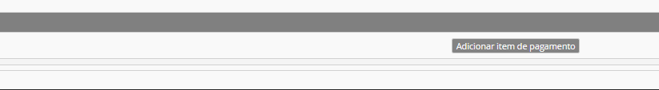

# Ação Social

_A Ação Social Escolar (ASE) Resume-se a um conjunto de medidas destinadas a garantir a igualdade de oportunidades de acesso e sucesso escolares a todos os alunos e a promover medidas de apoio socioeducativo destinadas aos alunos de agregados familiares cuja situação económica determina a necessidade de comparticipações financeiras_

                                                              Direção-Geral de Educação 

## Pagamentos

Quando abordamos  o tema **ação social**, mencionamos diretamente os pagamentos a efetuar nos estabelicimentos de ensino por parte dos alunos.

Para tal, existe determinados passos a seguir para que o procedimento seja feito corretamente:

1º Passo: Na **matrícula** do aluno, colocar a data de ínico de frequência

2º Passo: No **separador ASE**, atribuir o escalão de abono do aluno, comprovado pela Segurança Social da Madeira.

3º Passo: No separador **Pagamentos** deve preencher a grelha do mês (Onde refere os dias da semana que o aluno almoça na escola) e grava. Depois deve clicar **Retificar mês atual**.

No início do ano letivo, as escolas devem juntar aos pagamentos a **inscrição** e o **seguro Escolar**.
 

> [!WARNING]  
> Caso o aluno seja transferido de escola, não paga novamente a inscrição e o seguro escolar. 

Caso o aluno entre na escola no decorrer do ano letivo, a escola deve fazer o processo de pagamento de inscrição e de seguro escolar manualmente: 

- No separador **pagamentos** deve clicar em "adicionar item de pagamento" e selecionar inscrição e seguro escolar. 

## Presenças na cantina

Quando abordamos a ação social, ligamos automáticamente aos pagamentos e as faltas por mês.

> [!WARNING]  
>-  Que tipo de faltas existem?
>-  E quando devem ser marcadas?

No **separador alunos** deve clicar em faltas por mês. Pode constar que existem 4 tipos de faltas:

Tabela

| Tipo de faltas          | Quando marcar       | Horário    | Pagamentos |
| :---------------------: |:-------------------:| :---------:|:----------:|
| **Avisadas**    | São faltas avisadas com antecedência| marcar até às 16:30 do dia anterior |Será descontada na mensalidade no mês seguinte
| **Não avisadas**     | São faltas que não foram avisadas previamente | ---- |Esc. 1 paga o valor da refeição. Outros escalões não têm retorno do valor pago.
| **Imprevistas**   |       Faltas avisadas com pouca antecedência     |  das 16:30 do dia anterior até ao meio dia do próprio dia |   Valor será descontado no mês seguinte.|
| **Não previstas**  | É marcado quando o aluno não costuma comere nesse dia almoça. Ou quando o aluno avisa que vai faltar e no dia está presente e almoça.       |  ----  |O valor da refeiçao é cobrado no mês seguinte. 

> É importante manter as faltas e presenças atualizadas para que o processamento dos pagamentos seja feito corretamente. 
