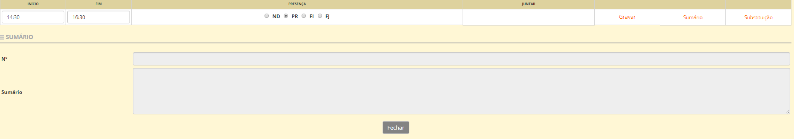
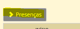

# Sumários

É importância que todas as aulas lecionadas tenham registo do sumário. Este refere-se ao resumo, mencionando as principais ideias trabalhadas ou exploradas na sala de aula.

Relembramos que os sumários devem ser preenchidos pelo docente responsável pela disciplina ou atividade, na plataforma place, dentro do prazo estabelecido por cada estabelecimento de ensino.

Caso o prazo não seja respeitado, o sumário é fechado e só a direção da escola, após pedido do docente responsável, poderá abrir novamente o respetivo sumario.

Todos os docentes deve fazer o sumário, preenchendo os dados presentes.    

No ato do sumário, o professor faz a marcação de presenças dos alunos, clicando no item que diz **Presenças**

No caso de substituições, o sumário é feito pelo docente que deu a aula, mencionando especificamente que foi uma substituição e o horário efetivo.

> [!WARNING]  
> Recomendamos que todos os docentes guardem os PDF dos seus súmários  semanal ou mensalmente.

