# Horários

*"Tempo letivo"- Carga horária semanal organizada em períodos de 45/50 minutos*... *Em situações justificadas, a escola poderá utilizar uma diferente organização da carga horária semanal dos alunos devendo, contudo, respeitar os totais, assim como o máximo global indicado para cada ciclo e ano de escolaridade."*

[Portaria 265/2016](http://joram.madeira.gov.pt/joram/1serie/Ano%20de%202016/ISerie-121-2016-07-13sup.pdf)

**Creche, Pré-Escolar e 1º Ciclo*
 
| Componente         | Carga Horária           | Total  |
|:--------------- |:----------------:| :-----:|
| **Componente Letiva**     | 25 horas | 25 horas |
|**Componente não Letiva**     | 4 horas        |  4 horas|

É importante que as escolas atribuam um horário a todos os docentes a lecionar na escola para que possa haver uma melhor gestão escolar.

> [!WARNING]  
> Na criação de horários, deve tomar atenção às datas de início e de fim. Caso o professor seja substituído, por alguma razão, deve terminar o horário do docente e criar um novo para o docente que irá substituir. 

A escola deve manter os horários sempre atualizados, podendo editá-los sempre que for necessário. 

**Ano 2018/2019**

Para a construção dos horários dos docentes devem seguir as seguintes instruções:

Tendo em conta que todos os alunos estão matriculados e as turmas estão construídas deve:

1. Validar as interrupções Letivas 

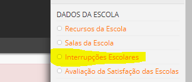

2. Verificar as Salas das atividades ou aulas. 

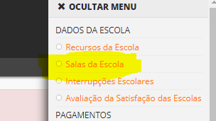

3. Assegurar que todos os **docentes** estão inseridos

4. Verificar os dados profissionais de todos os docentes (Editar a ficha pessoal). Preencher corretamente todos os itens. 

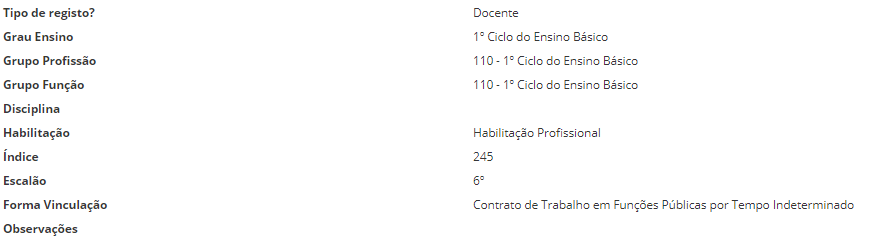

Depois de estar criado e editado a ficha de cada docente começamos por organizar:

                                      **A Curricular**
Todas as disciplinas que **fazem parte do Currículo**:

**1º Ciclo**

- Português
- Matemática
- Estudo do Meio
- Educação Artística
- Educação Física
- Apoio ao Estudo
- Inglês (3º e 4º ano
- Educação Moral e Religiosa

**Titulares e Educadores**

a) Selecionar o Docente e clicar em cima do nome 

b) Abre os tipos de Cargos (Turmas e Disciplinas)

**1º Ciclo**

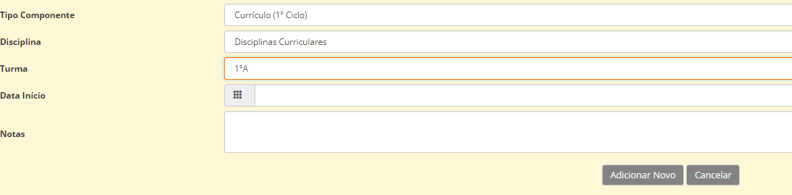

**Pré-Escolar**

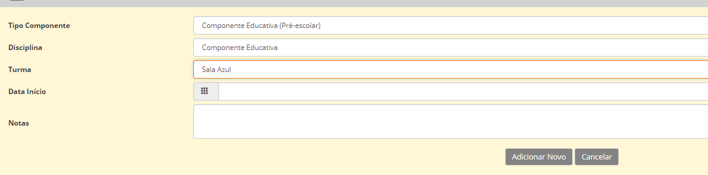

**Creche**

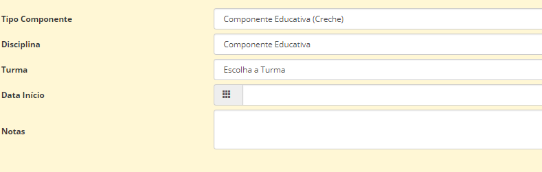

Em cada uma das valências deve preencher corretamente:

- Tipo de componente
- Disciplina
- Turma/Sala
- Colocar Data de Início
- Guardar informações. 

                   A Curricular (mas que não são dadas pelo titular da turma)

Fazemos o mesmo procedimento que os titulares, **apenas mudamos as disciplinas**:

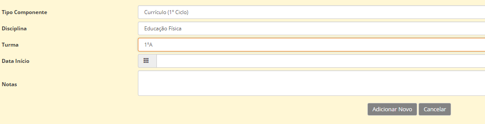

Fazemos este procedimento para as disciplinas de:

- Educação Física
- Educação Artística
- Inglês (1º e 2º ano encontram-se na **Oferta Complementar**; 3º e 4º ano já fazem parte do **Currículo**)
- Apoio ao Estudo
- Educação Moral e Religiosa

No caso dos docentes que auxiliam na disciplina de **TIC**, devem fazer o mesmo procedimento, escolhendo:

- **Componente Curricular Transversal**
- Disciplina
- turma 
- Data de Início 

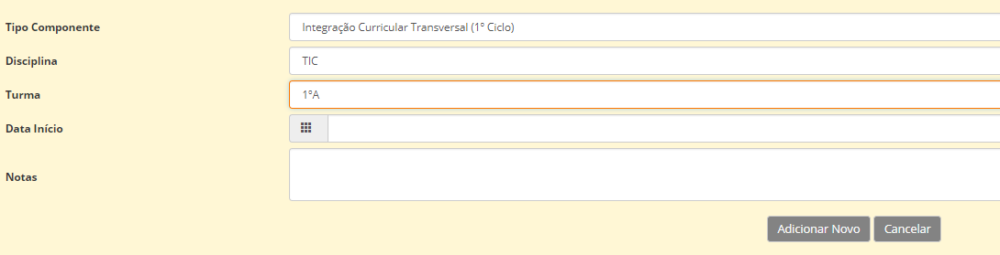

## Cargos 

Os cargos inserem-se nas áreas dadas que **não façam parte do Currículo**

Em relação a este assunto houve uma pequena alteração:

1. Cabe a Escola **criar os seus cargos**. Para tal, deverá aceder ao separador Docentes e ir ao lado direito ao Menu. Clicar nas Definições de Cargos. 

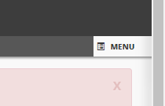

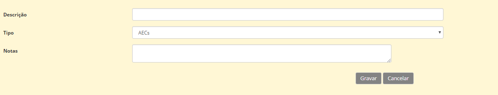
a) Descrever o Cargo (dá o nome que achar melhor, de acordo com o interesse da escola)
b) Escolher o tipo de cargo
c) Gravar

**Exemplo** dos Vários cargos que as escolas podem adicionar

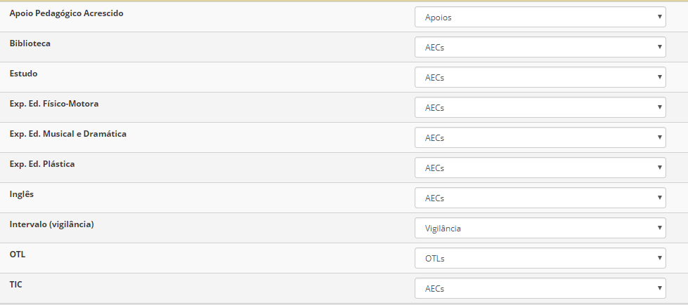

No caso do Ensino Especial, ou melhor, da **Educação para Inclusão** devem igualmente criar cargos com esta designação, salientando a **valência** caso seja necessário.

- Educação para a Inclusão pré-escolar
- Educação para a Inclusão 1º Ciclo

Depois de ter os cargos todos criados, deve aceder ao separador dos Docentes e aí preencher os **"Cargos e Atividades"**

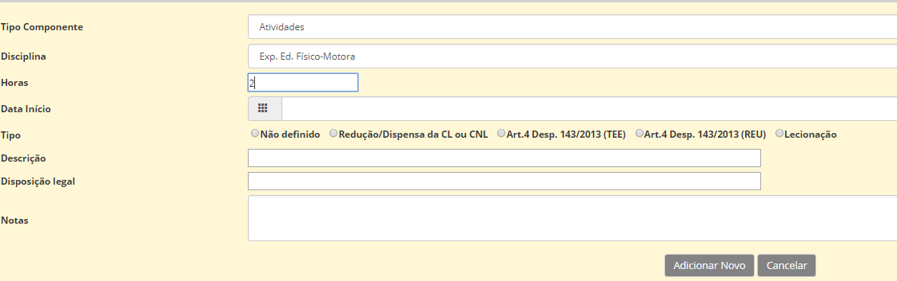

- Mencionar o que cada docente leciona. É importante preencher o tipo de cargo para que as horas sejam definidas, preenchidas e entendidas corretamente. 

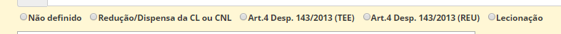

### Turmas

Os horários das turmas são criados nas **respetivas turmas e não nos docentes**

1. Deve aceder a **turma**
2. Clicar no separador **horário**
3. Editar
4. Criar Blocos:

- Escolher o dia da semana
- Horário da aula
- Componente
- Disciplina
- Sala
- Docente
- Gravar

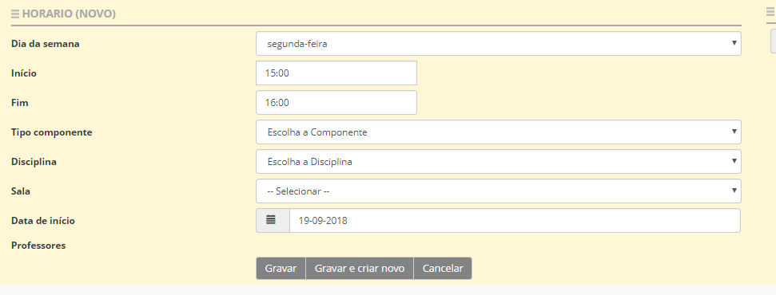

> [!NOTE]  
> Sempre que criarem novos blocos com data de início anterior a data de criação, devem atualizar o bloco desde o início para que os sumários sejam gerados. Este procedimento é feito no **horário da turma** e não no do professor.

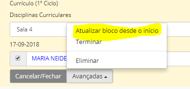

Exemplo de Horário da Titular do 1º Ciclo

                                      **Tipos de Cargos**  

| Tipos de **Cargos** existentes          | Designações (eventuais)  |
| --------------- |:----------------:|
| Acerto de Horário    | Amamentação, Sindicatos, Antiguidade, Intervalos... |
| AEC´s      | Biblioteca, Ed. Física, Inglês, Música, TIC, Estudo...         |
| Apoios    | Todo o tipo de apoio fornecido pela Escola |
| Cargos de Gestão Executiva    | Coordenação |
| Cargos de Gestão Intermédia      | Coordenador Regional...         |
| Clubes   | Todo o tipo de clubes criados pela escola     |
| OTL´s    | OTL |
| Outras atividades em trabalho na Escola     | Coordenador de TIC, Tratamento documental, Pesquisa e Organização de Matéria...         |
| Projetos    | Todos os projetos criados pela escola     |
| Substituições    |  |
| Tempo Letivo (Fora da Escola)    | Direção Artística e Multimédia        |
| Tempo não letivo (Fora da Escola)    | Preparação de Atividades, Reuniões...       |
| Titulares de Turma    |  |
| Vigilância     | Supervisão no Recreio, no refeitório...    |

> [!IMPORTANT]  
> As designações apresentadas anteriormente são apenas algumas ideias existentes. Não deverão ser únicas e exclusivas (não existem só estas). Cada escola pode criar a designação que achar mais adequada ao tipo de cargo que deseja anexar.

