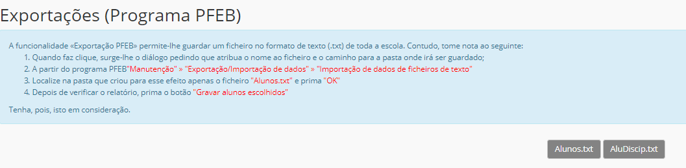

# Exportações

A funcionalidade **exportações** existente no Menu na página principal da plataforma place serve para explorar alguns dados sobre os alunos.

Permite a manuntenção de importação e exportação de dados dos alunos com ajuda do Programa PFEB

> [!NOTE]  
> A escola deve assegurar, sempre, a proteção dos dados de todos os alunos da escola.

