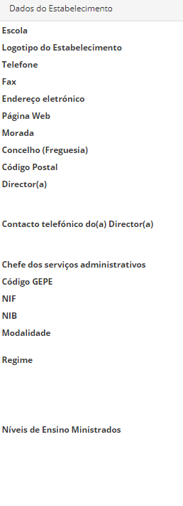

# Recursos da Escola

Esta funcionalidade encontrada no Menu, tem o objetivo de manter os dados da escola corretos e atualizados para uma melhor gestão e organização escolar.

A escola deve preencer as informações e deve, sempre que necessário, atualizar as informações quando haja alterações das mesmas.

Devem preencher os **dados da escola**, mas também outros itens igualmente importantes, nomeadamente

- Recursos Humanos
- Recursos Materiais
- Hardware
- Quadro Interativo
- Cartões eletrónicos

 

Devem ignorar os itens que não dizem respeito ao seu estabelecimento de ensino, preenchendo apenas os que fazem parte das vossas informações. 