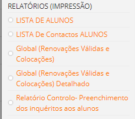
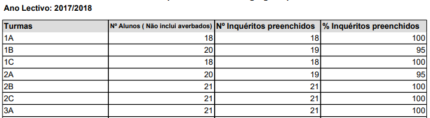

# Relatórios

Os relatórios são documentos desenvolvidos em PDF que auxiliam as escolas a terem uma ideia global da sua instiuição aos seus alunos e apoios dados aos mesmos. 
 Neste separador podemos encontrar cinco documentos fundamentais, nomeadamente:

1- **Lista de alunos**: 

Lista completa de todos os alunos que frequenta a instituição, sinalizando os alunos que recebem apoio aos manuais e material escolar.

2- **Contactos**
Lista completa dos nomes das crianças, dos encarregados de educação e do contacto telefónico.

3- **Renovações**

Lista de alunos com renovação válida no ano corrente.

4- **Renovações dealhado**

Lista de alunos com dados de intificação do aluno e do encarregado do educação que foram colocados na escola. 

5- **Inquerito dos alunos** 

No separador *inqueritos aos alunos*, ao clicar consegue ter a preceçao de como está a decorrer o preenchimento dos mesmos por parte dos professores. Informa a tuma, o número de alunos e quantos inquerito já foram ou não preenchidos, dando uma percentagem final. 

 
