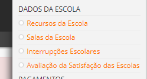

# Interrupções Letivas

O calendário escolar é composto por diversas datas de início e fim de períodos, de feríados nacionais, regionais e do concelho que devem ser respeitados e, acima de tudo, devem ser registados nesta funcionalidade para que a gestão dos sumários, das faltas e da alimentação seja feita corretamente, sem conseguências posteriores. 
 

Neste sentido, é importante que as interrupçoes letivas sejam preenchidas corretamente, inclusive os feriados do concelho e as tolerâncias de ponto concebidas, uma vez que este registo está automaticamente relacionado com o gerar dos sumários.

> [!NOTE]  
> Esta interrupção deve ser feita no horário da escola, no horário do professor e no horário do educador, se assim o desejar.

